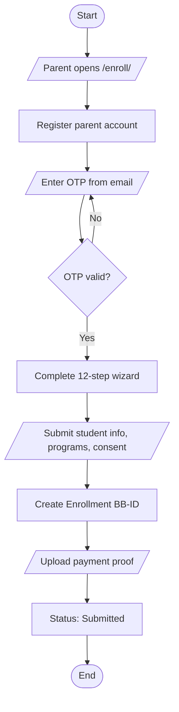
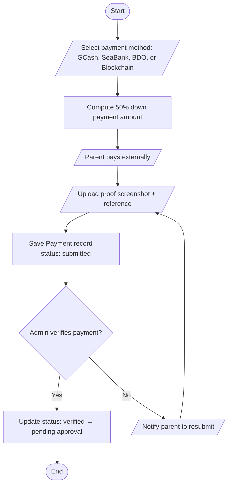
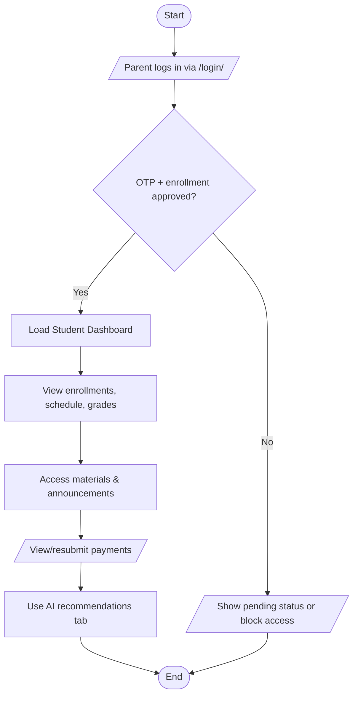
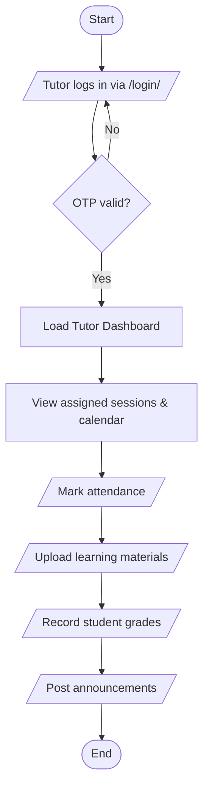
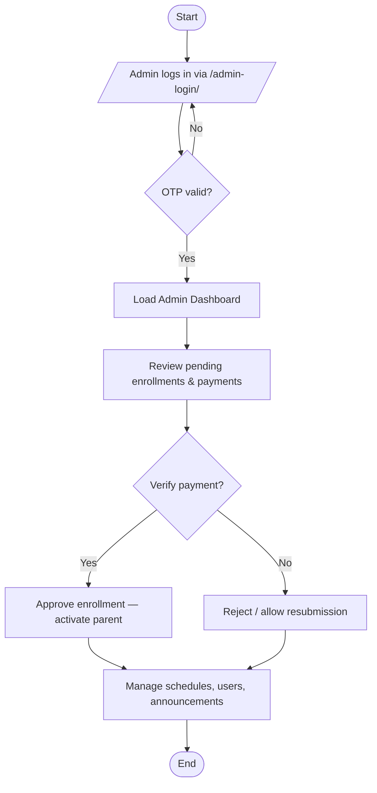
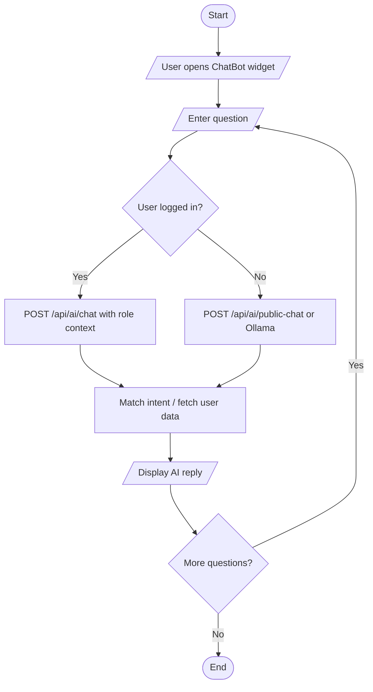
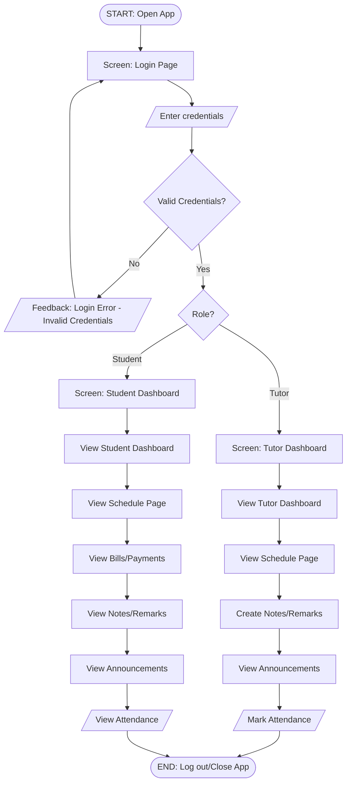

# Bee Bright System Flowcharts

## 1. Student Enrollment

---

## 2. Billing and Payment

---

## 3. Student Dashboard

---

## 4. Tutor Dashboard

---

## 5. Admin Dashboard

---

## 6. AI Chatbot

---

## 7. Mobile Application

---

## 8. Connected MVP Flowchart (All Features)

> The AI Chatbot widget is globally mounted on every page and available to all users (logged in or public) at any time. It is shown as a parallel note below each dashboard section rather than as a sequential step.

```mermaid
flowchart TD

    %% ══════════════════════════════════════════
    %% ENTRY POINT
    %% ══════════════════════════════════════════
    START([START: Open Bee Bright]) --> GATE{New or returning user?}

    %% ══════════════════════════════════════════
    %% FEATURE 1 — Student Enrollment
    %% ══════════════════════════════════════════
    GATE -- New Parent --> F1_A[/Parent opens /enroll/ page/]
    F1_A --> F1_B[Register parent account]
    F1_B --> F1_C[/Enter email + password + mobile/]
    F1_C --> F1_D[/OTP sent to email/]
    F1_D --> F1_E{OTP valid?}
    F1_E -- No --> F1_ERR[/Feedback: Invalid OTP — resend/]
    F1_ERR --> F1_D
    F1_E -- Yes --> F1_F[Parent account verified & activated]
    F1_F --> F1_G[Complete 12-step enrollment wizard]
    F1_G --> F1_H[/Submit student info, programs, consent/]
    F1_H --> F1_I[System creates Enrollment BB-ID]
    F1_I --> F1_J[Enrollment status: submitted]

    %% ══════════════════════════════════════════
    %% FEATURE 2 — Billing and Payment
    %% ══════════════════════════════════════════
    F1_J --> F2_A[/Select payment method: GCash, SeaBank, or BDO/]
    F2_A --> F2_B[System computes 50% down payment amount]
    F2_B --> F2_C[/Parent pays externally via selected method/]
    F2_C --> F2_D[/Upload proof screenshot + reference number/]
    F2_D --> F2_E[Save Payment record — status: submitted]
    F2_E --> F2_F[/Email confirmation sent to parent/]

    %% ══════════════════════════════════════════
    %% FEATURE 5 — Admin Dashboard
    %% ══════════════════════════════════════════
    F2_F --> F5_A[/Admin logs in via /admin-login//]
    F5_A --> F5_B[/Enter email + password/]
    F5_B --> F5_C[/OTP sent to admin email/]
    F5_C --> F5_D{OTP valid?}
    F5_D -- No --> F5_DERR[/Feedback: Invalid OTP — resend/]
    F5_DERR --> F5_C
    F5_D -- Yes --> F5_E[Load Admin Dashboard]
    F5_E --> F5_F[Review pending enrollments & submitted payments]
    F5_F --> F5_G{Verify payment?}
    F5_G -- No --> F5_REJ[Reject payment — allow resubmission]
    F5_REJ --> F5_RNOTIF[/Notify parent to resubmit proof/]
    F5_RNOTIF --> F2_D
    F5_G -- Yes --> F5_H[Payment status: verified → pending approval]
    F5_H --> F5_I{Approve enrollment?}
    F5_I -- No --> F5_AREJ[Reject enrollment]
    F5_AREJ --> F5_ANOTIF[/Notify parent of rejection/]
    F5_ANOTIF --> F5_END([End — enrollment rejected])
    F5_I -- Yes --> F5_J[Approve enrollment — activate parent account]
    F5_J --> F5_K[/Email sent: enrollment approved/]
    F5_K --> F5_L[Manage schedules, users & announcements]

    %% ══════════════════════════════════════════
    %% FEATURE 4 — Tutor Dashboard
    %% (Admin assigns tutor after approval)
    %% ══════════════════════════════════════════
    F5_L --> F4_A[/Tutor logs in via /login//]
    F4_A --> F4_B[/Enter email + password/]
    F4_B --> F4_C[/OTP sent to tutor email/]
    F4_C --> F4_D{OTP valid?}
    F4_D -- No --> F4_DERR[/Feedback: Invalid OTP — resend/]
    F4_DERR --> F4_C
    F4_D -- Yes --> F4_E[Load Tutor Dashboard]
    F4_E --> F4_F[View assigned sessions & calendar]
    F4_F --> F4_G[/Mark student attendance/]
    F4_G --> F4_H[/Upload learning materials/]
    F4_H --> F4_I[/Record student grades/]
    F4_I --> F4_J[/Post announcements/]

    %% ══════════════════════════════════════════
    %% FEATURE 3 — Student Dashboard
    %% (Parent logs in after enrollment approved)
    %% ══════════════════════════════════════════
    F5_J --> F3_A[/Parent logs in via /login//]
    GATE -- Returning Parent --> F3_A
    F3_A --> F3_B[/Enter email + password/]
    F3_B --> F3_C[/OTP sent to email/]
    F3_C --> F3_D{OTP + enrollment approved?}
    F3_D -- No --> F3_ERR[/Show pending status — await admin approval/]
    F3_ERR --> F3_WAIT([End — check back later])
    F3_D -- Yes --> F3_E[Load Student Dashboard]
    F3_E --> F3_F[View enrollments, schedule & grades]
    F3_F --> F3_G[Access learning materials & announcements]
    F3_G --> F3_H[/View or resubmit payment proof/]

    %% ══════════════════════════════════════════
    %% FEATURE 6 — AI Chatbot
    %% Available as a floating widget on ALL pages
    %% for ALL roles including public visitors
    %% ══════════════════════════════════════════
    F3_H --> F6_NOTE[AI Chatbot widget available on all pages]
    F4_J --> F6_NOTE
    F5_L --> F6_NOTE
    F6_NOTE --> F6_A[/User opens ChatBot widget/]
    F6_A --> F6_B[/Enter question/]
    F6_B --> F6_C{User logged in?}
    F6_C -- Yes --> F6_D[POST /api/ai/chat with role context]
    F6_C -- No --> F6_E[POST /api/ai/public-chat or Ollama]
    F6_D --> F6_F[Match intent / fetch user data]
    F6_E --> F6_F
    F6_F --> F6_G[/Display AI reply tailored to role/]
    F6_G --> F6_H{More questions?}
    F6_H -- Yes --> F6_B
    F6_H -- No --> F6_DONE[Return to dashboard]

    %% ══════════════════════════════════════════
    %% FEATURE 7 — Mobile Application
    %% ══════════════════════════════════════════
    F6_DONE --> F7_A([START: Open Mobile App])
    F7_A --> F7_B[Screen: Login Page]
    F7_B --> F7_C[/Enter credentials/]
    F7_C --> F7_D{Valid Credentials?}
    F7_D -- No --> F7_ERR[/Feedback: Login Error - Invalid Credentials/]
    F7_ERR --> F7_B
    F7_D -- Yes --> F7_E{Role?}

    F7_E -- Tutor --> F7_T1[Screen: Tutor Dashboard]
    F7_T1 --> F7_T2[View Tutor Dashboard]
    F7_T2 --> F7_T3[View Schedule Page]
    F7_T3 --> F7_T4[Create Notes/Remarks]
    F7_T4 --> F7_T5[View Announcements]
    F7_T5 --> F7_T6[/Mark Attendance/]
    F7_T6 --> FINISH

    F7_E -- Student --> F7_S1[Screen: Student Dashboard]
    F7_S1 --> F7_S2[View Student Dashboard]
    F7_S2 --> F7_S3[View Schedule Page]
    F7_S3 --> F7_S4[View Bills/Payments]
    F7_S4 --> F7_S5[View Notes/Remarks]
    F7_S5 --> F7_S6[View Announcements]
    F7_S6 --> F7_S7[/View Attendance/]
    F7_S7 --> FINISH

    FINISH([END: Log out / Close App])
```

